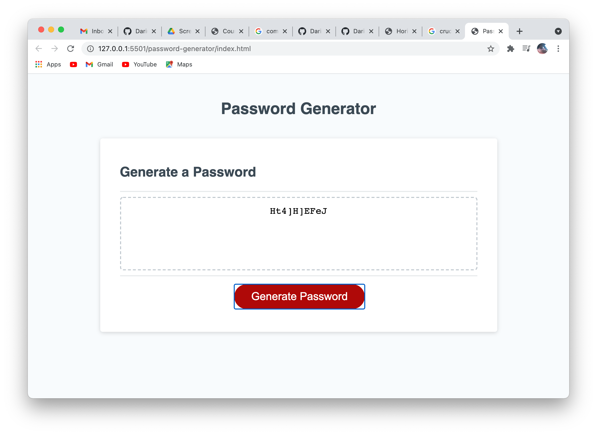

## Project Title

Paasword Generator

## Description

In this project, JavaScript was used to generate a password for the user. The user is prompted to choose a character length between 8-128. Then they are asked if they want 4 options of characters to be included in their password. Based off their responses, a random password will be generated containing their chosen criteria. 

1. [Installation requirements](#Installation)
2. [Deployed App](#Deployed)
3. [Contributions](#Contributions)
4. [screenshots](#Screenshots)
5. [Questions](#questions)

## Installation

"HTML", "CSS", "JavaScript"

## Deployed 

https://dariushay.github.io/password-generator/ 

## Contributions

Darius Hay https://github.com/DariusHay

## Screenshots

## Questions

If you have any additional questions about this project, you can find me on GitHub at DariusHay https://github.com/DariusHay, or you can email me at dariushay@gmail.com, thank you.
   