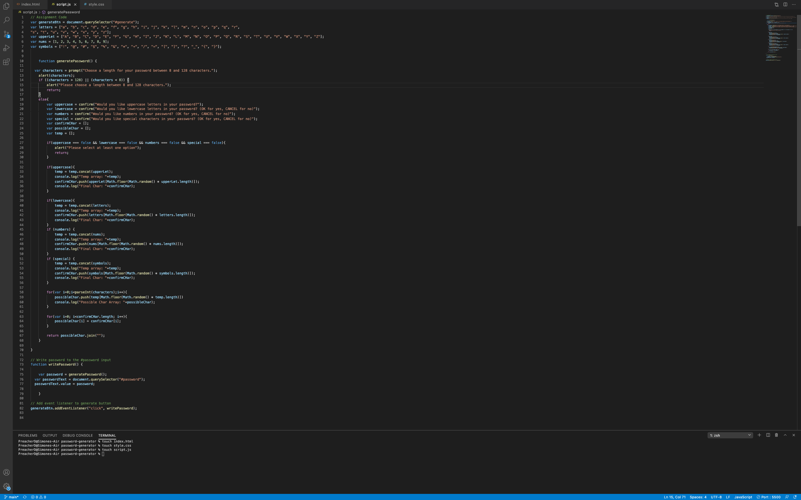

# password-generator
In this project, I used javascript to generate a password for the user. The user chooses a character lenght of 8-128 them are asked if they want 4 options of characters to be included in their password. Based off their responses, the computer coding will generate a passord based off their preferred criteria and return it back to them. 
# Screenshot of Javascript coding
 
# URL
http://127.0.0.1:5500/index.html    